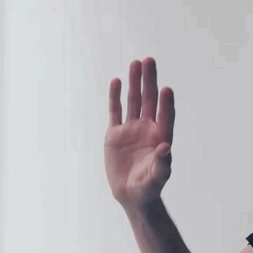

[](https://classroom.github.com/a/KfEU5Azw)


# Assignment 7: Pointing

## Setup
1. Clone the repo and navigate to it via `cd assignment-07-pointing-daniel-felix`.
2. Set up a virtual environment by running `python -m venv .venv`.
3. Activate the virtual environment using `.venv\Scripts\activate` on Windows or `source .venv/bin/activate` on Linux/Mac.
4. Install the required dependencies via `pip install -r requirements.txt`.


## 1. Pose-Based Pointing Technique
[`pointing_input.py`](pointing_input.py) tracks hand movement using Google's [MediaPipe Hand Landmarker](https://developers.google.com/edge/mediapipe/solutions/vision/hand_landmarker) and controls the cursor with `pynput`. The cursor follows the **midpoint between the thumb and index fingertips**, so pinching the two together barely shifts it. **Pinching** the thumb and index finger triggers a left click. To keep the cursor steady, the position is smoothed with the [One Euro Filter](https://doi.org/10.1145/2207676.2208639), which cuts jitter when the hand is still while staying responsive during quick movements. Keys are read only while the camera preview window is focused (via `cv2.waitKey`), so they can't leak from another focused window and accidentally toggle or quit the tracker.

```bash
python pointing_input.py [camera_id]
```

| Key / Action | Result |
|--------------|--------|
| Move hand | Move the mouse pointer |
| Pinch thumb + index | Left click |
| `M` | Toggle mouse control (movement + clicking) on/off |
| `D` | Toggle the hand skeleton and live pinch distance |
| `Q` | Quit |



> For the most reliable click detection, hold your remaining fingers extended.


## 2 Fitts’ Law Application
[`fitts_law.py`](fitts_law.py) is a `pyglet` implementation of a **two-dimensional tapping task**. **Every click (hit or miss)** is logged automatically to `data/fitts_<technique>_<num_targets>_<W>_<D>_<pid>.csv`, one row per click, so both movement time and error rate / endpoint scatter can be analysed. Because the task reacts to the OS cursor, it works with the mid-air pointing technique from task 1, a mouse, or a touchpad.

Columns: study/config fields plus `target_id`, `step` (sequence position), `click_x`/`click_y` (click position), `target_x`/`target_y` (target center), `success` (1 = hit, 0 = miss), `mt_ms` (time since the previous successful click), `timestamp`.

```bash
python fitts_law.py [--config fitts_config.json] [--pid N] [--num-targets N] [--width W] [--distance D] [--iterations N] [--latency MS] [--technique pose|mouse|touchpad]
```

Parameters are read from [`fitts_config.json`](fitts_config.json), command-line argument overrides the config file.

| Parameter | Description | Default |
|-----------|-------------|---------|
| `--config` | Path to the JSON config file | `fitts_config.json` |
| `--pid` | Participant ID, used in the log file name and every logged row | `1` |
| `--num-targets` | Number of targets in the ring | `10` |
| `--width` | Target diameter `W` in pixels | `60` |
| `--distance` | Ring diameter `D` (movement amplitude) in pixels | `400` |
| `--iterations` | Number of full rings to repeat | `3` |
| `--latency` | Artificial pointer latency in ms (see task 4) | `0` |
| `--technique` | Input device label (`pose`/`mouse`/`touchpad`) | `mouse` |

| Key / Action | Result |
|--------------|--------|
| Click the red target | Record acquisition and advance to the next target |
| `R` | Restart the study |
| `Q` / `Esc` | Quit |


## 3 Steering Law Application

[`steering_law.py`](steering_law.py) is a `pyglet` implementation of a **steering (tunnel) task**. The cursor must enter the highlighted start goal, then steer through the horizontal tunnel to the goal at the opposite end without crossing the walls. Each completed one-way traversal (left→right or right→left) is logged automatically to `data/steering_<technique>_<W>_<A>_<pid>.csv`, one row per traversal. Timing starts when the cursor leaves the start goal and ends when it reaches the end goal; wall crossings are counted as violations. Like the Fitts' task it reacts to the OS cursor, so it works with mid-air pointing, a mouse, or a touchpad.

Columns: study/config fields plus `direction` (`LR`/`RL`), `start_ts`/`end_ts`, `duration_ms` (movement time), and `violations` (times the cursor left the corridor). `violations = 0` is a clean pass; use the count as the accuracy measure alongside `duration_ms`.

```bash
python steering_law.py [--config steering_config.json] [--pid N] [--width W] [--amplitude A] [--iterations N] [--latency MS] [--technique pose|mouse|touchpad]
```

Parameters are read from [`steering_config.json`](steering_config.json); command-line arguments override the config file.

| Parameter | Description | Default |
|-----------|-------------|---------|
| `--config` | Path to the JSON config file | `steering_config.json` |
| `--pid` | Participant ID, used in the log file name and every logged row | `1` |
| `--width` | Tunnel width `W` (wall-to-wall clearance) in pixels | `50` |
| `--amplitude` | Tunnel length `A` (goal-to-goal distance) in pixels | `500` |
| `--iterations` | Number of full go-and-return traversals | `5` |
| `--latency` | Artificial pointer latency in ms (see task 4) | `0` |
| `--technique` | Input device label (`pose`/`mouse`/`touchpad`) | `mouse` |

| Key / Action | Result |
|--------------|--------|
| Steer from start goal to the red goal | Record the traversal and turn around |
| `R` | Restart the study |
| `Q` / `Esc` | Quit |

## 4 Adding Latency

Both [`fitts_law.py`](fitts_law.py) and [`steering_law.py`](steering_law.py) accept a `--latency MS` option (also settable via the config files as `latency_ms`) that delays the pointer by a fixed number of milliseconds. Raw pointer positions are pushed into a time-stamped buffer and read back delayed; all hit detection (clicks, goal entry, wall crossings) uses the delayed position, and `latency_ms` is recorded in every logged row. The OS cursor is hidden so the participant follows only the delayed in-app cursor.

```bash
python fitts_law.py --latency 150
python steering_law.py --latency 150
```

## 5 Evaluating Input Techniques

[`run_study.py`](run_study.py) runs a full session for one participant: 40 runs launched as subprocesses. That is 4 techniques (pose, mouse, mouse + 150 ms, touchpad) × 5 Fitts' and 5 Steering conditions, each with `--iterations 3`.

```bash
python run_study.py --pid 3            # run participant 3
python run_study.py --pid 3 --camera 1 # specify the camera for pose runs
```

The script handles the run order automatically: the **technique order** follows a balanced Latin square (Williams design) keyed to `--pid` so device-order effects cancel across every four participants, the **condition order** within each technique is shuffled reproducibly from a fixed seed, and **pose blocks** start and stop [`pointing_input.py`](pointing_input.py) on their own. Controls are `Enter` to start, `s` to skip, and `q` to quit during a run, then `Enter`/`r`/`q` to continue, redo, or quit afterwards.

The collected data (one CSV per run) is in [`data/`](data/), and all results, plots, and the per-technique comparison are in the analysis notebook: [`analysis.ipynb`](analysis.ipynb).

### Study design

The study is within-subjects: every participant completes every condition. We compare the four input techniques on two tasks. For Fitts' Law we vary target width `W` and distance `D`; for Steering Law we vary tunnel width `W` and amplitude `A`.

To keep the session short, we change only one parameter at a time while holding the other fixed. The center value is shared by both sweeps, so 5 conditions are enough to cover 3 widths and 3 distances per law:

| Law | Width sweep (distance fixed) | Distance sweep (width fixed) |
|-----|------------------------------|------------------------------|
| Fitts' (px) | `W` ∈ {40, **60**, 90}, `D` = 400 | `D` ∈ {250, **400**, 550}, `W` = 60 |
| Steering (px) | `W` ∈ {60, **100**, 150}, `A` = 500 | `A` ∈ {350, **500**, 650}, `W` = 100 |

Each condition is repeated 3 times per participant. We measure movement time and hit/miss rate for Fitts' Law (`mt_ms`, `success`) and traversal time and wall violations for Steering Law (`duration_ms`, `violations`).

### Participants and apparatus

Three people took part: the two of us (PID 1 and PID 2) and a friend from another course who isn't in ITT (PID 3). PID 2 and PID 3 used a Dell XPS 13 7390 2-in-1 with an external 27-inch 1440p screen, the laptop's built-in touchpad and webcam, and a Logitech M196 Bluetooth mouse at default Windows DPI. The blinds were shut and the overhead light turned on to keep side sunlight from interfering with the hand tracking.

### Procedure

Each participant first warmed up to get accustomed to pose tracking with one round of the [Human Benchmark Aim Trainer](https://humanbenchmark.com/tests/aim) (30 targets). They then worked through the full session in the order set by the script, free to pause between runs. A session lasted around 30 minutes.

### Problems encountered during the study runs

The first teammate ran their session on Linux (PID 1) largely without issues. Most problems below came up when the second teammate later ran their session on Windows (PID 2), and the corresponding fixes were added in response; the last two are general observations we simply noted.

- **Closing a task window also killed `pointing_input.py`.** Pressing **Q** to close a task window shut down the input script too, because it listened for keypresses globally and caught the keypress even when its window wasn't in focus. Fixed by reading the **q**/**m**/**d** keys directly from the camera preview window, so keypresses meant for other windows can't leak through.

- **No way to resume after an interruption.** If the script stopped partway through, rerunning it would start over and overwrite the CSV files already recorded. *Fixed:* `run_study` now checks what data has already been captured and only runs the missing conditions, which let us resume PID 2 after `pointing_input.py` was accidentally closed at 20 runs without repeating anything.

- **The study window flickered during pose blocks.** Under load, the screen refresh sometimes missed its timing and briefly showed a blank buffer. This appeared only on Windows (PID 2), not on Linux (PID 1). *Fixed:* turning off vsync in `fitts_law` and `steering_law`.

- **Arm fatigue during pose runs.** Holding the arm up for the length of a pose block was tiring. Participants could rest their arm between runs.

- **One empty recording (`fitts_mouse_10_60_400_lat0_1.csv`).** This run for PID 1 came out empty because it was overwritten when the script was restarted. We chose not to re-record it and left it out of the analysis.
