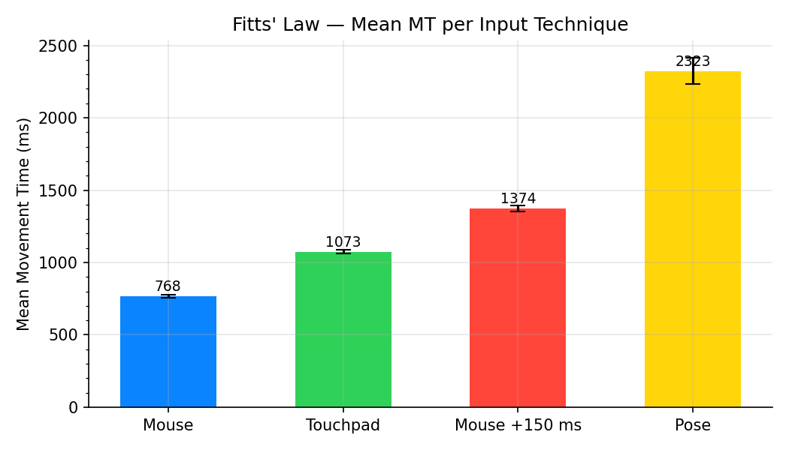
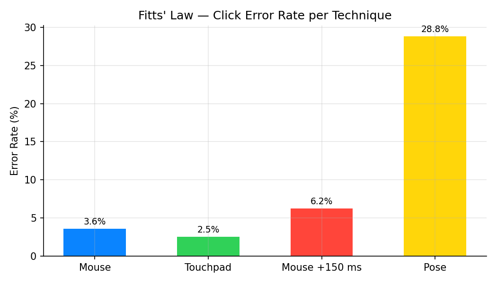
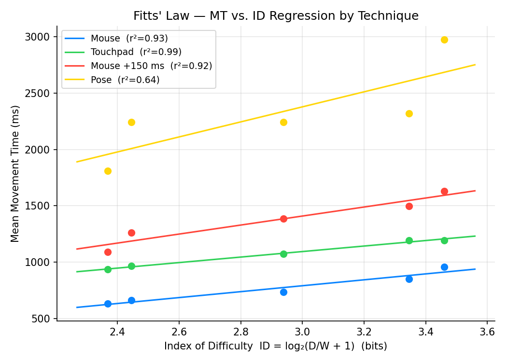
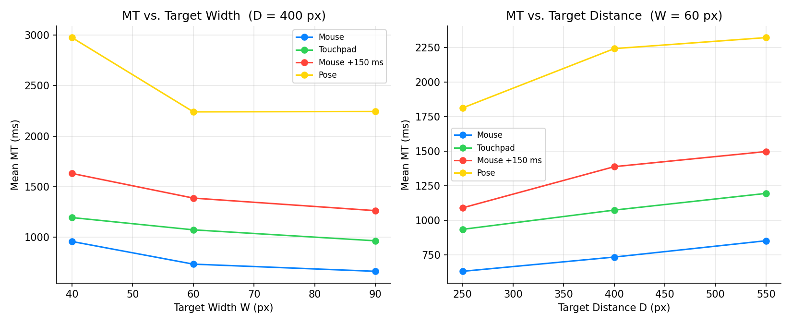
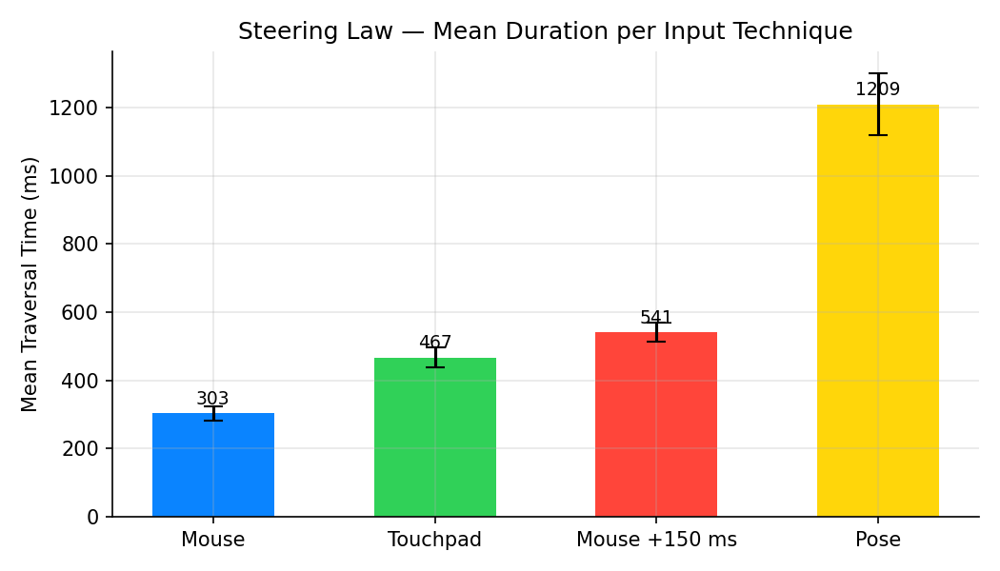
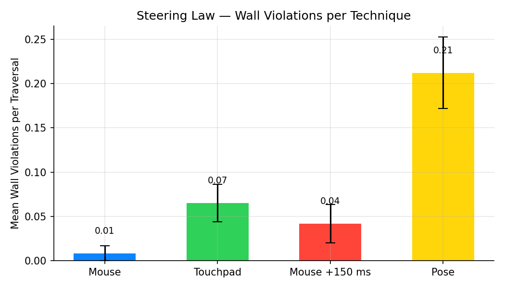
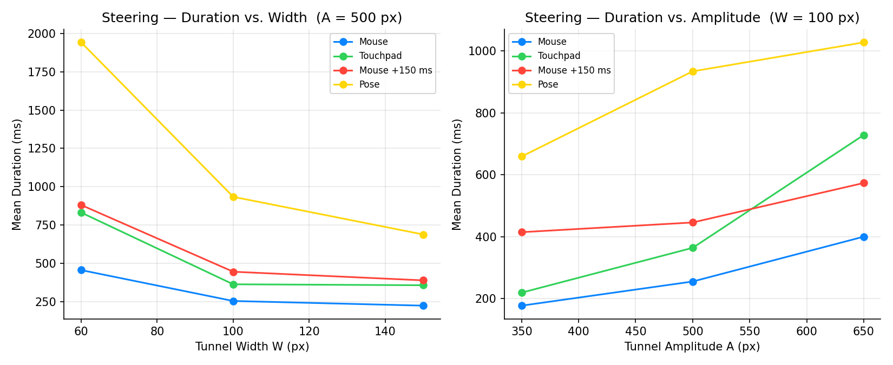
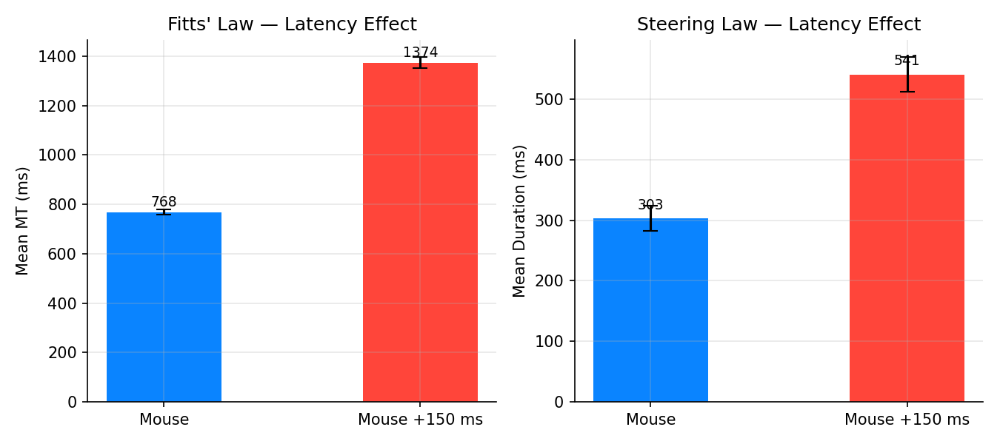

# Results — Daniel's Analysis

The figures below are generated by [`analysis_daniel.py`](analysis_daniel.py), which writes them to [`../assets/`](../assets/).

## Fitts’ Law

The empirical performance metrics for the four input techniques across all target conditions are summarized in the table below:

| Technique | Mean Movement Time (ms) | Error Rate (%) | Index of Difficulty Slope ($b$, ms/bit) | Trial-Level Fit ($r^2$) | Aggregated Fit ($r^2$) |
| :--- | :---: | :---: | :---: | :---: | :---: |
| **Mouse** | **768** $\pm$ **252** | **3.6%** | **262.5** | **0.218** | **0.93** |
| **Touchpad** | **1073** $\pm$ **310** | **2.5%** | **244.4** | **0.125** | **0.99** |
| **Mouse +150 ms** | **1374** $\pm$ **513** | **6.2%** | **399.6** | **0.122** | **0.92** |
| **Pose** | **2323** $\pm$ **2198** | **28.8%** | **663.2** | **0.018** | **0.64** |

### Speed and Accuracy Trade-offs

* **The Baseline:** The unlatenced standard **Mouse** was the fastest pointing method (**768 ms**) with a low error rate (**3.6%**).
* **Touchpad Accuracy:** Interestingly, the **Touchpad** yielded the lowest overall error rate (**2.5%**), though it required roughly **300 ms** more than the mouse per target selection. This implies participants were intentionally conservative, trading speed for precision.
* **The Pose Penalty:** **Pose-based pointing** was severely degraded. It took more than **3x longer** than the mouse baseline (**2323 ms**) and suffered from a massive **28.8% error rate**. The enormous standard deviation ($\pm$ **2198 ms**) highlights extreme instability, largely caused by hand jitter and the mechanical difficulty of maintaining steady cursor coordinates while executing a mid-air pinch gesture with both fingers (Fixing the cursor on the thumb and keeping it static compared to the rest of the hand may help to keep clicks where they are supposed to be).

### Modeling and Parameter Sweeps

* **Model Fits:** When individual trials are aggregated by condition (as seen in `fitts_regression.png`), the Fitts' Law models provide exceptionally strong fits for Touchpad ($r^2 = 0.99$), Mouse ($r^2 = 0.93$), and Latenced Mouse ($r^2 = 0.92$). The raw, unaggregated trial-level fits are lower due to natural human motor variance.
* **Sensitivities ($b$):** The slope coefficient $b$ represents a device's performance penalty as tasks get harder. **Pose** was highly sensitive to task difficulty ($b = 663.2$ ms/bit). As seen in the parameter sweeps, when target width dropped to **40 px**, the Pose selection time spiked aggressively up to nearly **3000 ms**.

---

## Steering Law

The traversal times and corridor accuracy for the path-steering task are detailed below:

| Technique | Mean Traversal Duration (ms) | Mean Wall Violations per Pass |
| :--- | :---: | :---: |
| **Mouse** | **303** $\pm$ **226** | **0.01** $\pm$ **0.09** |
| **Touchpad** | **467** $\pm$ **358** | **0.07** $\pm$ **0.25** |
| **Mouse +150 ms** | **541** $\pm$ **312** | **0.04** $\pm$ **0.24** |
| **Pose** | **1209** $\pm$ **1099** | **0.21** $\pm$ **0.49** |

### Throughput and Corridor Control

* **Baseline:** Path steering was optimal with a standard **Mouse** (**303 ms**, **0.01 violations**).
* **Touchpad vs. Latency:** The **Touchpad** and **Mouse +150 ms** tracked closely in overall duration. However, data suggests that participants adapted to the 150 ms delay, achieving fewer wall violations (**0.04**) than the Touchpad (**0.07**).
* **Pose Constraints:** **Pose tracking** struggled significantly within constrained paths (**1209 ms**), resulting in a high rate of wall violations (**0.21**).

### Geometry Constraints

The parameter sweeps validate the core mechanics of the Steering Law:
* **Tunnel Width ($W$):** Narrowing the tunnel to **60 px** triggered steep duration spikes across all input methods. For **Pose**, traversing a tight tunnel nearly doubled the time required compared to wider paths.
* **Tunnel Amplitude ($A$):** As tunnel length scaled up linearly from **350 px** to **650 px**, traversal durations scaled upward proportionally across all four modalities.

---

## The Cost of Latency

Isolating the **Mouse** against **Mouse +150 ms** highlights the performance toll of input delay:
* **Tapping Cost:** Injecting a 150 ms lag increased mean movement time by **78.9%** (**768 ms** $\rightarrow$ **1374 ms**) and nearly doubled selection errors (**3.6%** $\rightarrow$ **6.2%**). The slope steepened from **262.5** to **399.6** ms/bit, proving that latency acts as a direct multiplier of human motor difficulty.
* **Steering Cost:** In the tunnel task, latency caused a **78.5% slowdown** (**303 ms** $\rightarrow$ **541 ms**) and a four-fold jump in wall violations (**0.01** $\rightarrow$ **0.04**). Because steering demands continuous visual feedback loops, the delayed cursor routinely forced participants to over-correct and oscillate in their steering behaviour.

---

## Key Takeaways

1. **Hierarchy of Control:** Performance matches standard HCI expectations: Mouse > Touchpad > Latenced Mouse \gg Pose.
2. **The "Midas Touch" and Pose Instability:** While the MediaPipe-driven vision solution provides highly accessible tracking, it is not yet viable for pixel-precise desktop interaction. The act of pinching fingers together introduces unavoidable spatial shifting at the exact moment of selection. This mechanical artifact accounts for the severe **28.8% Fitts' error rate**.
3. **Adaptive User Strategies:** Humans are remarkably adept at adjusting to artificial systems. When subjected to the **150 ms latency** environment, users counteracted the lag by slowing down and accepting a time penalty in order to keep target errors and wall violations under control.
